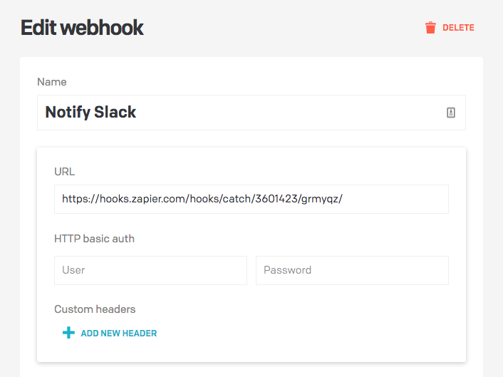
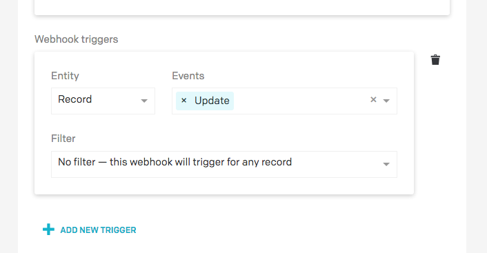
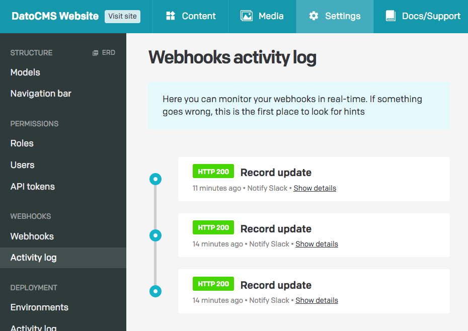

If you need to know when data has changed in one your projects, you can create customized webhooks to get HTTP notifications as soon the events occur.

For example, you might use webhooks as the basis to:

* Integrate/sync DatoCMS data with third-party systems (Snipcart, Shopify, Algolia, etc.);
* Get Slack/email notifications;
* Automatically post an update on Facebook/Twitter;
* Produce an automatic deploy on your staging environment;

You can connect DatoCMS webhooks to any endpoint you like — for example some custom AWS lambda function.

If you don't want to write any code, you can use [Zapier Webhooks](https://zapier.com/page/webhooks/) to connect a DatoCMS event with hundreads of different external services, creating any kind of complex automation workflow.

### Configure a webhook

You can setup a new webhook under the *Settings > Webhooks* section of your administrative area.

You can enter any URL as the destination for calls, add HTTP basic authentication and add custom HTTP headers:



#### Webhook triggers

Webhook triggers let you specify under which circumstances an HTTP call will be performed towards your endopoint:



You can add as many triggers as you want to a single webhook. DatoCMS supports events for these kind of objects:

* **Record**: triggers whenever a record is created, updated, deleted, published, unpublished or all of the above. Additionally, you can trigger the webhook only for specific records or records belonging to specific models
* **Model**: triggers whenever a model is created, updated, deleted or all of the above. Changes made to a model's field will trigger a call as well. Additionally, you can trigger the webhook only for specific models
* **Upload**: triggers whenever any upload is created, updated, deleted or all of the above
* **Deployment environment**: triggers whenever an environment gets deployed

### HTTP request details

DatoCMS will perform an HTTP POST request towards the specified endpoint. The HTTP body will be in JSON format, and will contain all the information relevant to the event just happened.

As an example, in the case of an event of record update, this will be the payload:

```JSON
{
  "entity_type": "item",
  "event_type": "update",
  "entity": {
    "id": "293467",
    "type": "item",
    "attributes": {
      "created_at": "2018-05-22T10:13:00.461Z",
      "updated_at": "2018-08-02T10:54:09.616Z",
      "is_valid": true,
      "avatar": {
        "path": "/205/1526984443-irene.png",
        "format": "png",
        "size": 242630,
        "alt": null,
        "title": null,
        "width": 329,
        "height": 286
      },
      "name": "Irene Oppo",
      "gallery": []
    },
    "relationships": {
      "item_type": {
        "data": {
          "id": "1423",
          "type": "item_type"
        }
      },
      "published_version": {
        "data": {
          "id": "716593",
          "type": "item_version"
        }
      },
      "current_version": {
        "data": {
          "id": "716593",
          "type": "item_version"
        }
      }
    }
  }
}
```

### Debug and keep track of webhooks activity

Each time a webhook gets triggered, DatoCMS creates a `WebhookCall` object that contains all the relevant information about what just happened. You can browse webhook calls under the *Webhooks activity log* section of your administrative area, or [using our API](https://www.datocms.com/content-management-api/#webhook_call-0).



In case something went wrong (4xx/5xx HTTP status code, server timeout, etc.) you will be able to manually resend the webhook:


