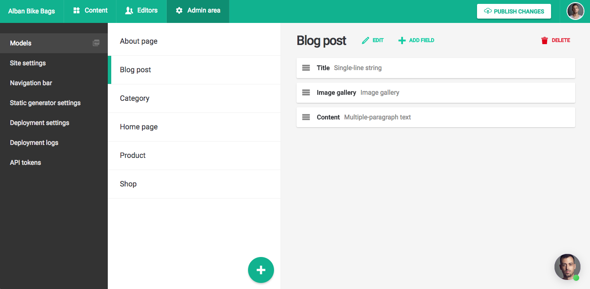
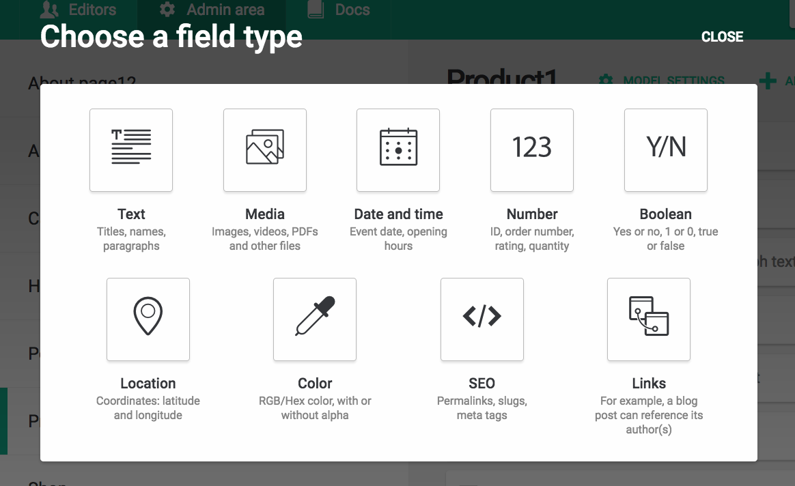
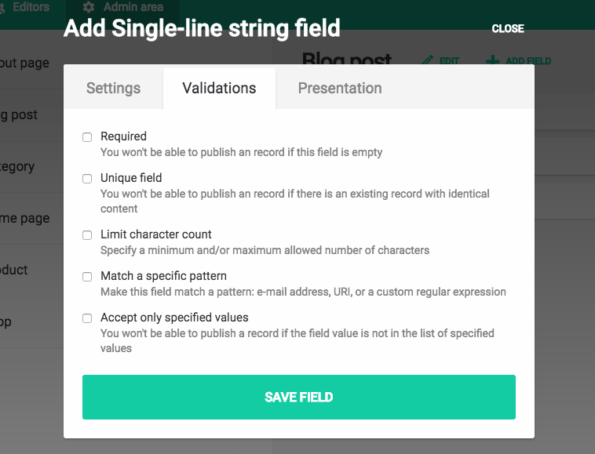
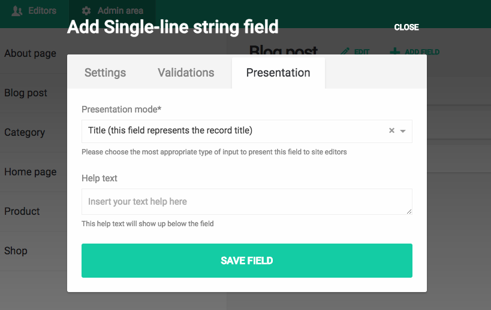

DatoCMS can be seen as a editor-friendly interface over a database, so the first step is to build the actual schema upon which users will generate the actual website content.

The way you define the kind of content you can edit inside each different administrative area passes through the concept of <strong>models</strong>, which are much like database tables.

Each administrative area can specify a number of different models, and they represent <em>blueprints</em> upon which users will store the website content. For example, a site can define different models for articles, products, categories, and so on.

You can create new models in the *Admin area > Models* section of your administrative area:

Each model consists of a set of <strong>fields</strong> that you define. Fields can can be one of the following:

* **Single-line string**: Ideal for titles, headings, etc.
* **Multiple-paragraph text**: For Markdown, HTML or plain text.
* [**Modular content**](/docs/introduction/modular-content/): To compose your content with text, images, videos, etc. in a Medium-like manner.
* **Integer** and **Floating-point number**: For storing integer SKUs, quantities, prices, etc.
* **Boolean**: For storing values that have two states, e.g. yes or no, true or false etc.
* **Date** and **DateTime**: A timestamp value for storing dates and times (ie. an event start, office opening hours).
* **File**: To store any kind of document (images, PDFs, ZIPs, etc.).
* **Multiple files**: To store one or more files (for sliders, carousels, etc.).
* **Video**: To reference to an external YouTube/Vimeo video.
* **Color**: For storing colors (with or without alpha channel).
* **Geolocation**: Coordinate values for storing the latitude and longitude of a physical location.
* **SEO meta tags**: To manage a page meta title, meta description, OpenGraph cards, etc.
* [**Slug**](/docs/introduction/slug-permalinks/): To generate a page permalink based on another textual field of the model.
* [**Single and multiple links**](/docs/introduction/links/): To model relationships between content, including other models. For example, linking a blog to a category.

Each field has a name and additional metadata, like validations, or particular configurations to better present the field to the editor (hints, etc.):

Fields in DatoCMS can also be localized, if you need to accept different values based on language.

DatoCMS stores the individual pieces of content you create from a model as <strong>records</strong>, which are much like table rows in a database. You (and your editors) can create new records of a certain model within the *Content* tab of your administrative area:

