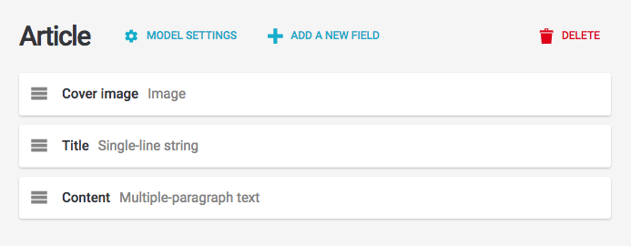

We released an NPM package to make it easy to programmatically read/create/edit/destroy any kind of resource a DatoCMS project might contain. Install the `datocms-client` package in your application:

```
$ npm install --save-dev datocms-client
```

Or, if you're using Yarn as package manager:

```
$ yarn add datocms-client
```

**Warning:** due to historical reasons and backward compatibility, the API exposes some different naming compared to the rest of the product: Models are called Item Types, while Records are called Items. Keep that in mind!

The first step is to require the DatoCMS package, and initialize the client with the read-write API token you can find under the *Admin area > API tokens* section. Let's create an `import.js` file with the following content:

```js
require('babel-polyfill');
const SiteClient = require('datocms-client').SiteClient;

const client = new SiteClient('YOUR_API_READWRITE_TOKEN');
```

Now, suppose we have an administrative area with an *Article* model, and we want to import a list of articles ie. from a JSON file:



The first thing to know is the ID of the model itself. Let's add the following line to pretty print the existing models:

```js
require('babel-polyfill');
const SiteClient = require('datocms-client').SiteClient;

const client = new SiteClient('YOUR_API_READWRITE_TOKEN');

client.itemTypes.all()
  .then((models) => console.log(models));
```

As you can see `client.itemTypes.all()` method returns a promise. Here's the output when we execute the script:

```
$ node import.js
[ 
  { 
    id: '7149',
    name: 'Article',
    singleton: false,
    sortable: false,
    apiKey: 'article',
    fields: [ '27669', '27667', '27668' ] 
  }
]
```

We can also inspect the fields contained in the model:

```js
// obtain all the fields of the model
client.fields.all("7149")
  .then((fields) => console.log(fields));

// Output:
//
// [ { id: '27667',
//     label: 'Title',
//     fieldType: 'string',
//     apiKey: 'title',
//     hint: null,
//     localized: false,
//     validators: {},
//     position: 2,
//     appeareance: { type: 'title' },
//     itemType: '7149' },
//   { id: '27668',
//     label: 'Content',
//     fieldType: 'text',
//     apiKey: 'content',
//     hint: null,
//     localized: false,
//     validators: {},
//     position: 3,
//     appeareance: { type: 'wysiwyg' },
//     itemType: '7149' },
//   { id: '27669',
//     label: 'Cover image',
//     fieldType: 'image',
//     apiKey: 'cover_image',
//     hint: null,
//     localized: false,
//     validators: {},
//     position: 1,
//     appeareance: {},
//     itemType: '7149' } ] ]
```

Great, here there are our three fields. Let's create our article:

```js
// create a new Article record
client.uploadFile('http://i.giphy.com/NXOF5rlaSXdAc.gif')
  .then((image) => {
    return client.items.create({
      itemType: '7149',
      title: 'My first article!',
      content: 'Lorem ipsum dolor sit amet, consectetur adipisicing elit, sed eiusmod.',
      coverImage: image
    })
  })
  .then(record => console.log(record));

// Output:
// { id: '43858',
//   updatedAt: '2017-03-20T14:34:30.249Z',
//   isValid: true,
//   title: 'My first article!',
//   content: 'Lorem ipsum dolor sit amet, consectetur adipisicing elit, sed eiusmod.',
//   coverImage: '1834832',
//   itemType: '7149' }
```

As you can see, we use the helper method `client.uploadFile` to pass DatoCMS the metadata of the image to associate to the record.

## Retrieving records

To retrieve the stored records:

```js
client.items.all({}, { allPages: true })
  .then((records) => console.log(records));
```

If you want to retrieve just the records of a specific model (ie. `article`):

```js
client.items.all({ 'filter[type]': 'article' }, { allPages: true })
  .then((records) => console.log(records));
```

You can also pass the model ID instead of the model API identifier.

## Linking records

If you have a record with some a link field (ie. an article linked to its category), during the creation you need to pass the ID of the linked record:

```js
client.items.create({
  itemType: '7150',
  name: 'My category',
})
  .then((category) => {
    return client.items.create({
      itemType: '7149',
      title: 'My first article!',
      content: 'Lorem ipsum dolor sit amet, consectetur adipisicing elit, sed eiusmod.',
      category: category.id,
    });
  })
  .then((record) => console.log(record));
```

If you have a "multiple links" field, then you need to pass the array of IDs:

```js
client.items.create({
  itemType: '7150',
  name: 'My category',
})
  .then((category) => {
    return client.items.create({
      itemType: '7149',
      title: 'My first article!',
      content: 'Lorem ipsum dolor sit amet, consectetur adipisicing elit, sed eiusmod.',
      categories: [category.id]
    });
  })
  .then((record) => console.log(record));
```

### Multi-language fields

If localization is enabled on some field, the format of the payload changes a little bit, as you need to pass an hash representing the value of the field for each of the locales you setup in your administrative area:

```js
// create a new Article record
client.uploadImage('http://i.giphy.com/NXOF5rlaSXdAc.gif')
  .then((image) => {
    return client.items.create({
      itemType: '7149',
      title: {
        en: 'My first article!',
        it: 'Il mio primo articolo!'
      },
      content: 'Lorem ipsum dolor sit amet, consectetur adipisicing elit, sed eiusmod.',
      coverImage: image
    })
  })
  .then(record => console.log(record));
```
