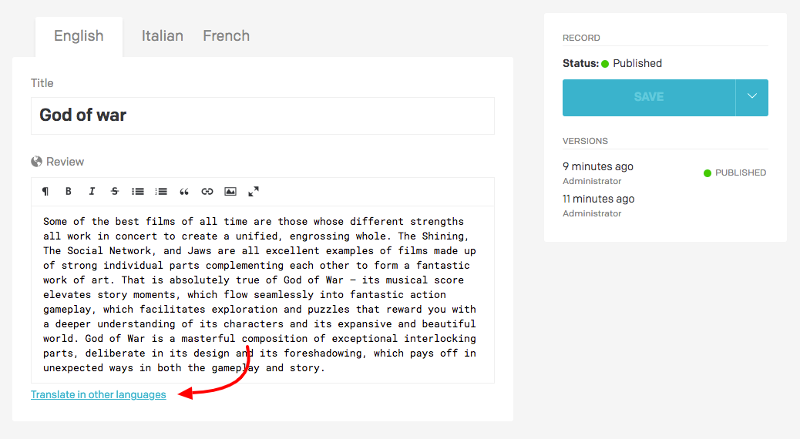
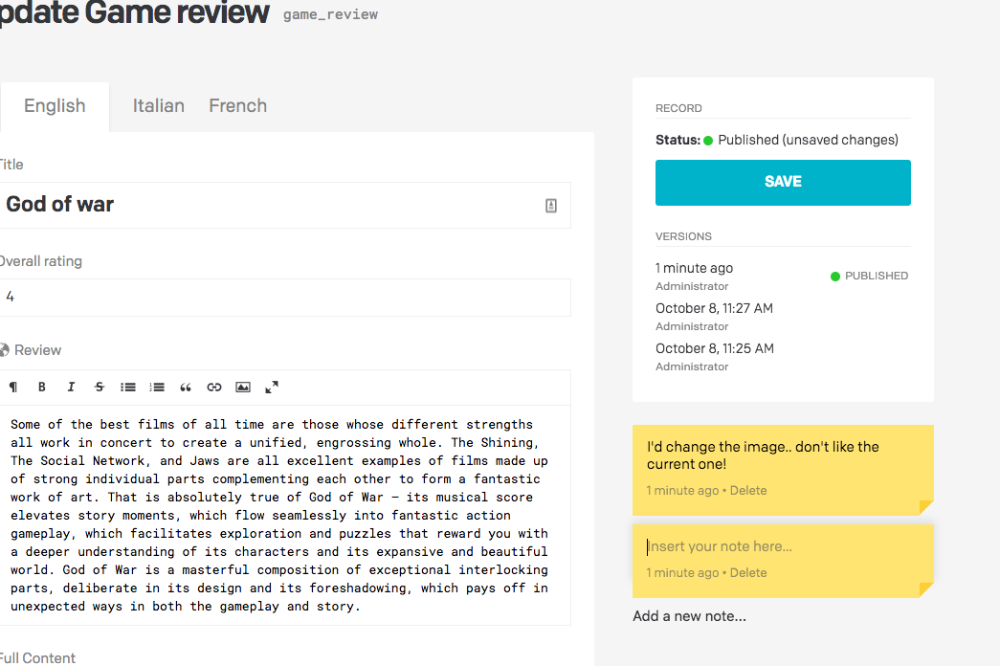

Plugins allow developers to extend the basic functionality of the DatoCMS administrative area. You, the developer, are in charge of writing and hosting the plugin.

Technically speaking Plugins are small HTML5 applications that exist in a sandboxed `<iframe>` and interact with the main DatoCMS webapp through a JS library you need to include — the [Plugins SDK](/docs/plugins/sdk-reference/).

They can be implemented with basic HTML and JavaScript, or using more advanced client-side frameworks such as React, Angular or Vue.

### Types of plugins

DatoCMS supports different kinds of plugins:

#### "Field editor" plugins

They reside in the record editor body and operate on top of a particular field, replacing the default field editor that DatoCMS provides with custom code.

An example of a field editor plugin is our [Star rating editor](https://github.com/datocms/plugins/tree/master/star-rating-editor) plugin, which will present an Integer field with a star rating widget instead of using the default textual input:

#### "Field addon" plugins

They also reside in the record editor body, but are placed underneath the field editor to provide additional info/behaviour. You can setup multiple field addons for every field.

An example of a field addon plugin is our [Yandex Translate](https://github.com/datocms/plugins/tree/master/yandex-translate) plugin, which makes it easier to automatically translate your content into secondary languages:

#### "Sidebar widget" plugins

Sidebar plugins are rendered on the sidebar of the record editor. They make most sense if the functionality provided by the plugin applies to an entire record instead of a single field.

An example is our [Notes](https://github.com/datocms/plugins/tree/master/notes) plugin, that you can use to add Post-It notes to your records:

A sidebar widget plugin is still assigned to a field which is then ommited from the entry editor. The field's value can be used to store data for the sidebar plugin.
