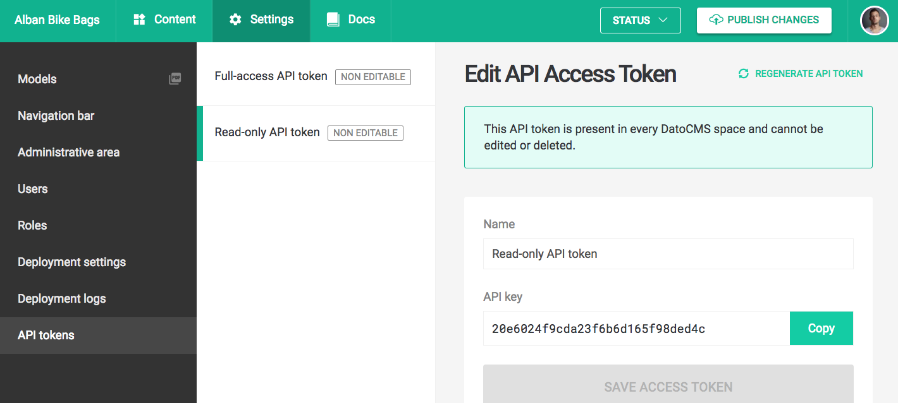
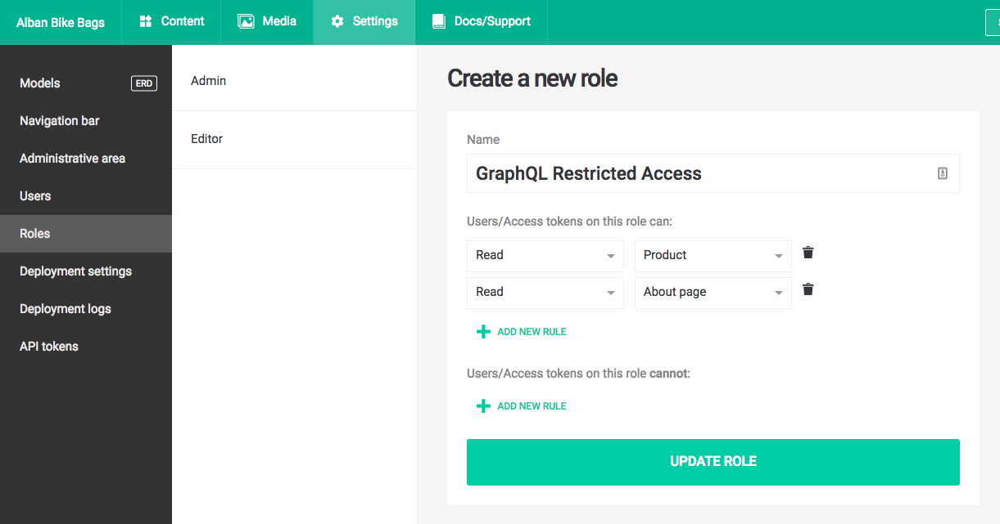
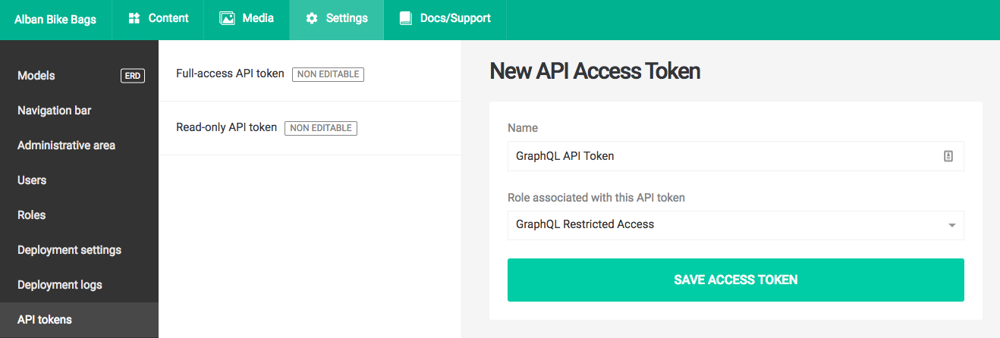

This document is a detailed reference to DatoCMS's Content Delivery API.

The Content Delivery API is used to retrieve content from one of your DatoCMS projects and deliver it to your web or mobile projects. If you are looking for APIs to manage content, you should use the [Content Management API](/content-management-api/).

Our APIs serve content via a powerful and robust content delivery network (CDN). Multiple datacenters around the world store a cached copy of your content. When a page request is made, the content is delivered to the user from the nearest server. This greatly accelerates content delivery and reduces latency.

### GraphQL

The Content Delivery API is written in GraphQL, which offers a number of advantages over classic REST APIs:

#### Strongly typed schema

Many developers have found themselves in situations where they needed to work with deprecated API documentation, lacking proper ways of knowing what operations are supported by an API and how to use them. GraphQL clearly defines the operations supported by the API, including input arguments and possible responses, offering an unfailing contract that specifies the capabilities of an API.

#### No more over-fetching and under-fetching

Developers often describe the major benefit of GraphQL as the fact that clients can retrieve exactly the data they need from the API. They don’t have to rely on REST endpoints that return predefined and fixed data structures. Instead, the client can dictate the shape of the response objects returned by the API.

#### Fewer roundtrips

One of the major issues of REST is that, in order to get the data you need, you are forced to call a number of different endpoints. Each API request to pull a resource is a separate HTTP request-response cycle. Fetching complicated data requires multiple round-trips between the client and server to render even a single view. On the contrary, GraphQL enables you to call several related functions without multiple round-trips.

### API Endpoint

DatoCMS offers a single GraphQL endpoint:

```
https://graphql.datocms.com/
```

The endpoint remains constant no matter what operation you perform, and it's read only — that is, it does not offer any *mutation operation*. You can use our [Content Management API](/content-management-api/) for that.

##### Preview endpoint

If you have the [Draft/Published system](/docs/introduction/versioning/#draftpublished-system) active on some of your models, you can use a different endpoint to access records at their latest version available, instead of the currently published: this can be useful on staging environments, or your local development machine:

```
https://graphql.datocms.com/preview
```

Both endpoints offer exactly the same queries, the only thing that will change will be the returned content.

### API Explorer

To see what queries are available in your schema you can use our [API Explorer](https://graphql.datocms.com/graphiql). Type your GraphQL query in the left-most text box and then press Play button:

<iframe src="https://graphql.datocms.com/graphiql?apitoken=faeb9172e232a75339242faafb9e56de8c8f13b735f7090964&query=%7B%0A%20%20allBlogPosts(orderBy%3A%5BpublicationDate_DESC%5D%2C%20first%3A%203)%20%7B%0A%20%20%20%20title%0A%20%20%20%20author%20%7B%0A%20%20%20%20%20%20name%0A%20%20%20%20%7D%0A%20%20%20%20publicationDate%0A%20%20%7D%0A%7D%0A"></iframe>

### Authenticating

To communicate with the GraphQL server, you'll need an API token. To start, you can find your read-only API token in the *Settings > API tokens* section of your administrative area:



#### Restricting access

If you want to restrict GraphQL access only to a selection of your DatoCMS models, you can generate a custom API token. To do that, first go to *Settings > Roles* and create a new role, specifying the models to whitelist:



You can then create a new API token associating it with the role you just created:



### Rate limits

API Rate limits specify the number of requests a client can make to DatoCMS APIs in a specific time frame. Since this API is meant to be used for delivering content from DatoCMS to apps, websites and other media, every site with a paying plan offers no limits on requests that hit our CDN.

### Communicating with GraphQL

In REST, HTTP verbs determine the operation performed. In GraphQL, you'll provide a JSON-encoded body even if you're performing a query operation, so the HTTP verb is always `POST`.

```bash
$ curl 'https://graphql.datocms.com/' \
    -H 'Authorization: YOUR-API-TOKEN' \
    -H 'Content-Type: application/json' \
    -H 'Accept: application/json' \
    --data-binary '{ "query": "query { allPosts { title } }" }'
```
