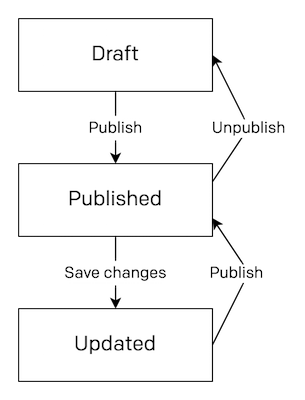

### What is record versioning?

Currently, DatoCMS produces a snapshot of a record each time it gets saved. This makes it possible to easily revert to previous versions when a record is accidentally modified. 

Versioning refers to the practice of producing multiple snapshots of a document. Record versioning allows DatoCMS users to view previously published versions of the record, find out who published a record, compare previous snapshots to the current version, and — when necessary — restore the content to the earlier state.

Record-level versioning stores all the content found in the record - including localized content and references to other records and uploads - but it does not create or store snapshots of linked entities. Thus, if you restore a record to the earlier version containing a reference to a deleted upload, the image field will be empty.

It is also important to remember that the version comparison only displays current locales and values. If your record was translated into Italian in the past, but later the Italian locale was removed from the model, the Italian text will no longer be visible or restorable. The same logic goes for deleted fields: any content that was stored within these fields in the past will no longer be displayed.

### Current vs published version

When you create a new record, it is put into a **Draft** status. This means that the record is still not published: you can continue making changes and saving the record without having to worry about showing unfinished content to your end users. Once you're satisfied with the changes, you can click on the **Publish** button: the latest revision of your record will be marked as the *Published version*, and it will be instantly available in the DatoCMS API. If you make a change to a Published record, it will be moved int a **Updated** status. Again, those changes won't be visible to end users and published until you explicitly click on the **Publish** button.

