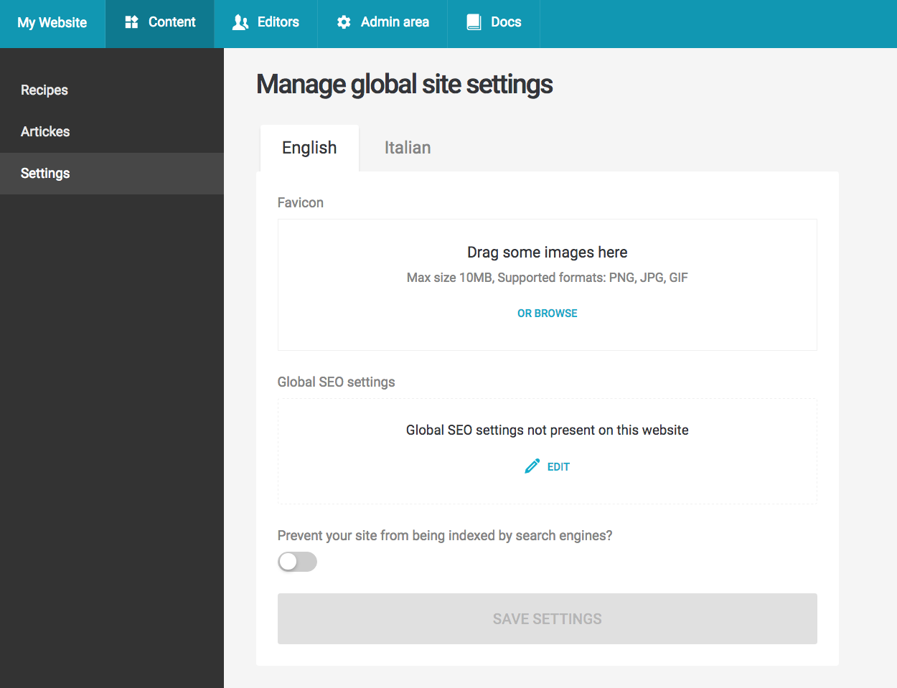

Given a record object, you can obtain its title, description, [OpenGraph](http://ogp.me/) and [Twitter card](https://dev.twitter.com/cards/overview) meta tags with the `.seo_meta_tags` method:

```ruby
# dato.config.rb

dato.blog_posts.first.seo_meta_tags

# => [
#   { tag_name: "title", content: "Bike Pannier - Alban Bike Bags" },
#
#   { tag_name: "meta",  attributes: { name: "description",         content: "Lorem ipsum..." } },
#   { tag_name: "meta",  attributes: { name: "twitter:card",        content: "summary" } },
#   { tag_name: "meta",  attributes: { name: "twitter:description", content: "Lorem ipsum..." } },
#   { tag_name: "meta",  attributes: { name: "twitter:image",       content: "https://www.datocms-assets.com/72/123-image.png" } },
#   { tag_name: "meta",  attributes: { name: "twitter:site",        content: "@AlbanBikeBags" } }
#   { tag_name: "meta",  attributes: { name: "twitter:title",       content: "Bike Pannier" } },
#
#   { tag_name: "meta",  attributes: { property: "article:modified_time", content: "2017-01-26T09:11:19Z" } },
#   { tag_name: "meta",  attributes: { property: "article:publisher",     content: "https://www.facebook.com/AlbanBags/" } },
#   { tag_name: "meta",  attributes: { property: "og:description",        content: "Lorem ipsum..." } },
#   { tag_name: "meta",  attributes: { property: "og:image",              content: "https://www.datocms-assets.com/72/123-image.png" } },
#   { tag_name: "meta",  attributes: { property: "og:locale",             content: "en_US" } },
#   { tag_name: "meta",  attributes: { property: "og:site_name",          content: "Alban Bike Bags" } },
#   { tag_name: "meta",  attributes: { property: "og:title",              content: "Bike Pannier" } },
#   { tag_name: "meta",  attributes: { property: "og:type",               content: "article" } },
# ]
```

Meta tags are generated merging the values present in the record's *SEO meta tags* field together with the *Global SEO settings* you can configure under *Content > Settings*:


If the record doesn't have a *SEO meta tags* field, the method tries to guess reasonable values by inspecting the other fields of the record (single-line strings and images).

Your page title will be composed concatenating the title of the record together with the *Title suffix* setting. If the total length of the title exceeds 60 characters, the suffix will be omitted.

---

### Favicon meta tags

Under the *Content > Settings* section you can also configure your website favicon:



You can get desktop, iOS, Android and Windows Phone favicon meta tags with the `dato.site.favicon_meta_tags` helper:

```ruby
# dato.config.rb

dato.site.favicon_meta_tags

# => [
#   { tag_name: "link", attributes: { sizes: "16x16", type: "image/png", rel: "icon", href: "https://www.datocms-assets.com/72/favicon.png?w=16&h=16" } },
#   { tag_name: "link", attributes: { sizes: "32x32", type: "image/png", rel: "icon", href: "https://www.datocms-assets.com/72/favicon.png?w=32&h=32" } },
#   { tag_name: "link", attributes: { sizes: "96x96", type: "image/png", rel: "icon", href: "https://www.datocms-assets.com/72/favicon.png?w=96&h=96" } },
#   { tag_name: "link", attributes: { sizes: "192x192", type: "image/png", rel: "icon", href: "https://www.datocms-assets.com/72/favicon.png?w=192&h=192" } },
#   { tag_name: "link", attributes: { sizes: "57x57", rel: "apple-touch-icon", href: "https://www.datocms-assets.com/72/favicon.png?w=57&h=57" } },
#   { tag_name: "link", attributes: { sizes: "60x60", rel: "apple-touch-icon", href: "https://www.datocms-assets.com/72/favicon.png?w=60&h=60" } },
#   { tag_name: "link", attributes: { sizes: "72x72", rel: "apple-touch-icon", href: "https://www.datocms-assets.com/72/favicon.png?w=72&h=72" } },
#   { tag_name: "link", attributes: { sizes: "76x76", rel: "apple-touch-icon", href: "https://www.datocms-assets.com/72/favicon.png?w=76&h=76" } },
#   { tag_name: "link", attributes: { sizes: "114x114", rel: "apple-touch-icon", href: "https://www.datocms-assets.com/72/favicon.png?w=114&h=114" } },
#   { tag_name: "link", attributes: { sizes: "120x120", rel: "apple-touch-icon", href: "https://www.datocms-assets.com/72/favicon.png?w=120&h=120" } },
#   { tag_name: "link", attributes: { sizes: "144x144", rel: "apple-touch-icon", href: "https://www.datocms-assets.com/72/favicon.png?w=144&h=144" } },
#   { tag_name: "link", attributes: { sizes: "152x152", rel: "apple-touch-icon", href: "https://www.datocms-assets.com/72/favicon.png?w=152&h=152" } },
#   { tag_name: "link", attributes: { sizes: "180x180", rel: "apple-touch-icon", href: "https://www.datocms-assets.com/72/favicon.png?w=180&h=180" } },
#   { tag_name: "meta", attributes: { name: "msapplication-square70x70logo", content: "https://www.datocms-assets.com/72/favicon.png?w=70&h=70" } },
#   { tag_name: "meta", attributes: { name: "msapplication-square150x150logo", content: "https://www.datocms-assets.com/72/favicon.png?w=150&h=150" } },
#   { tag_name: "meta", attributes: { name: "msapplication-square310x310logo", content: "https://www.datocms-assets.com/72/favicon.png?w=310&h=310" } },
#   { tag_name: "meta", attributes: { name: "msapplication-square310x150logo", content: "https://www.datocms-assets.com/72/favicon.png?w=310&h=150" } },
#   { tag_name: "meta", attributes: { name: "application-name", content: "Alban Bike Bags" } }
# ]
```

---

### How to use meta tags in your Jekyll website

In your `dato.config.rb` file you can dump the meta tags in the frontmatter of your Jekyll posts or as data files:

```ruby
# dato.config.rb

# Create a YAML data file to store global data about the site
create_data_file(
  "src/_data/settings.yml", 
  :yaml,
  favicon_meta_tags: dato.site.favicon_meta_tags
)

# Dump all the blog posts
dato.blog_posts.each do |article|
  directory "_posts" do
    create_post "#{article.slug}.md" do
      frontmatter(
        :yaml,
        title: article.title,
        seo_meta_tags: article.seo_meta_tags
      )
      content(article.content)
    end
  end
end
```

And in your Jekyll views, transform the data into proper HTML tags:

```html

<!DOCTYPE html>
<html>
<head>
  <!-- ... -->
  
    {{ tag | tagify }}
  
  
    {{ tag | tagify }}
  
</head>
<body>
  <h1>{{ page.title }}</h1>
</body>
</html>
```

Where `tagify` is a custom liquid filter you can put inside your project `_plugins` directory:

```ruby
# _plugins/tagify.rb

module Jekyll
  module TagifyFilter
    def tagify(input)
      name = input["tag_name"]
      content = input["content"]

      attributes = input.fetch("attributes", {}).
        map { |k, v| %Q(#{k}="#{CGI::escapeHTML(v)}") }

      if content.nil?
        "<#{[name, attributes].flatten.compact.join(' ')}>"
      else
        "<#{[name, attributes].flatten.compact.join(' ')}>#{content}</#{name}>"
      end
    end
  end
end

Liquid::Template.register_filter(Jekyll::TagifyFilter)
```
