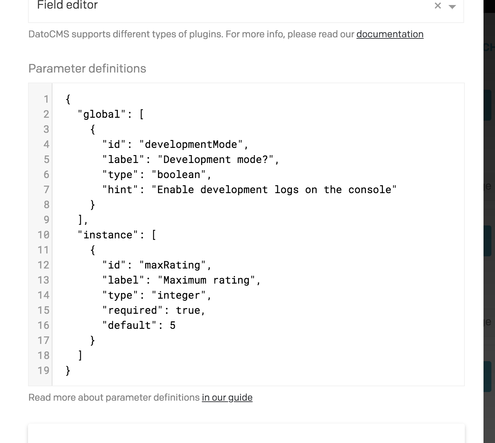
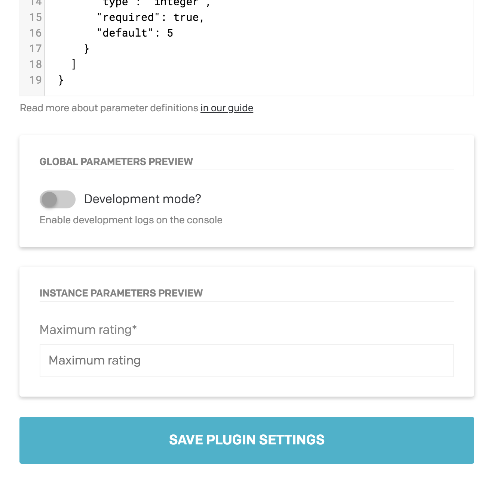

When building an plugin, you might feel the need to add some configuration options, so that you can reuse the same plugin with slight differences multiple times in different fields.

There are two types of configuration parameters that can be set up for an plugin:

* **Global parameters** are project-wide settings and are applied to every field within the project that uses the plugin. You can set them up under the *Settings > Plugins* section;
* **Instance parameters** are field-specific settings. Every time you assing an plugin to a field you can set different parameters directly within the Presentation tab of the fields's settings.

### Defining parameters

When creating a new plugin, you can define which configuration options it will accept using a specific JSON format:

As you can see, both global and instance parameters take an array of **parameter definitions**. Every parameter definition is an object constructed as described in the table below:

Property    | Type and value                               | Required? | Remarks
------------|----------------------------------------------|-----------|--------
`id`        | String                                       | yes       | Can contain only letters and numbers
`label`     | String                                       | yes       | Human readable name of the parameter
`type`      | `boolean`, `date`, `date_time`, `float`, `integer`, `string`, `text`, `json` or `color` | yes | The type of field to offer when editing this parameter
`hint`      | String                                       | no        | Further explanation of the purpose of the parameter
`required`  | Boolean                                      | no        | Whether the parameter value needs to be provided (defaults to `false`)
`default`   | Should match type                            | no        | Default value to use for the parameter

As soon as you edit the *Parameter definitions* field, a preview of the resulting fields will be shown under the field:

**WARNING:** Configuration parameters can be read by anybody who is allowed to use the plugin. It's not secure to use parameters to inject access tokens that permit data manipulation. Read-only tokens can be used but keep in mind their value is not hidden.
